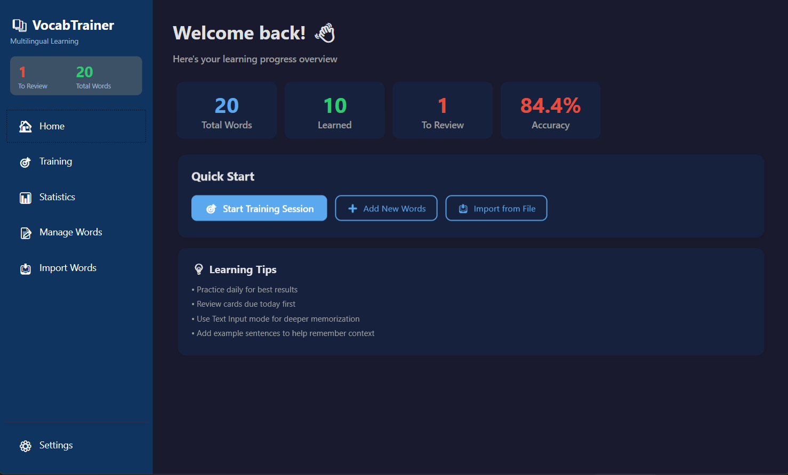
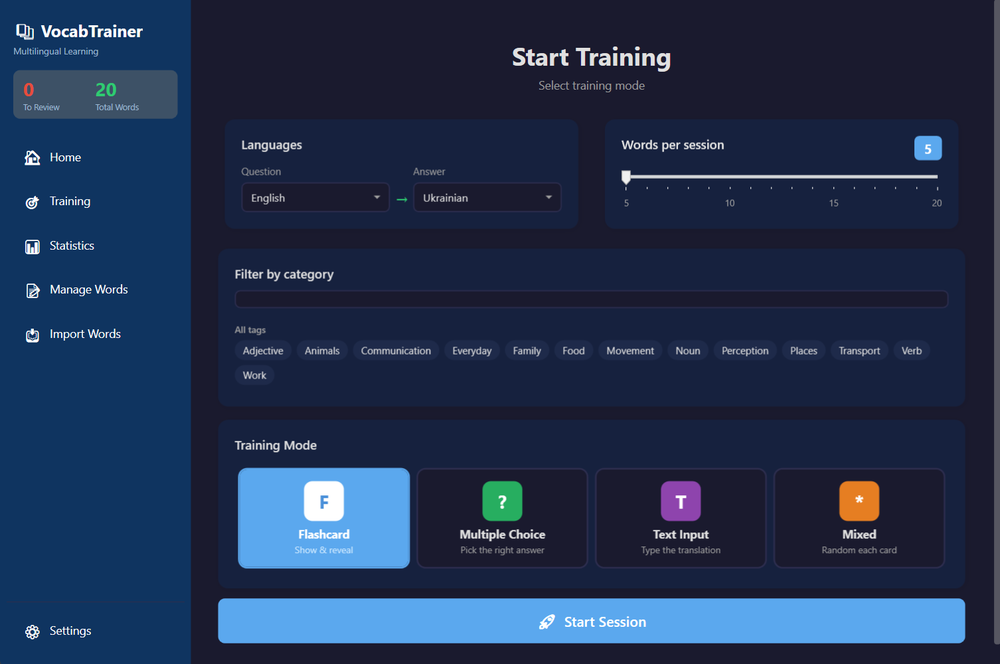
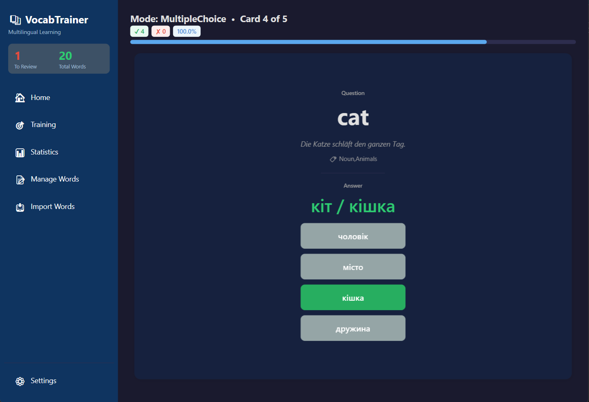
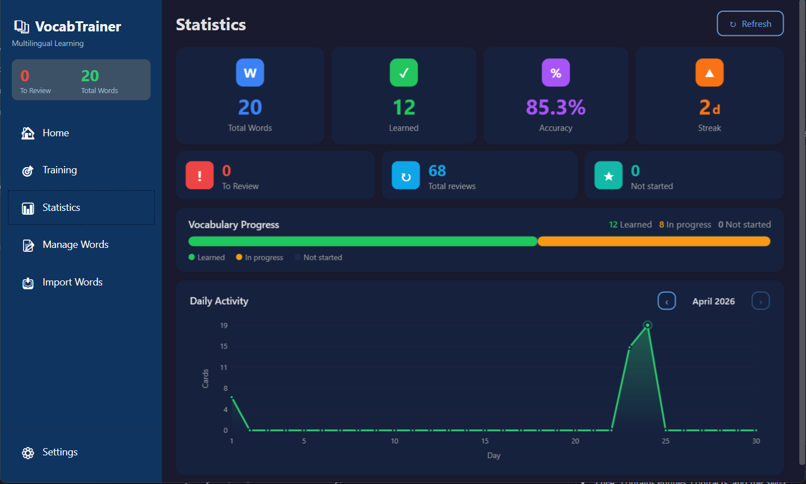

# VocabTrainer

Desktop vocabulary trainer built with WPF and .NET 8.

VocabTrainer is a local-first Windows application for learning vocabulary with spaced repetition, multiple training modes, import/export tools, and lightweight progress tracking. It is designed for fast everyday practice without accounts, cloud sync, or external services.


## Highlights

- Local-first architecture with SQLite storage
- SM-2-inspired spaced repetition scheduling
- Four training modes: Flashcard, Multiple Choice, Text Input, Mixed
- German, English, and Ukrainian study data support
- English and Ukrainian interface localization
- CSV and Excel import/export
- Dark and light themes

## Screenshots

<table>
  <tr>
    <td align="center" width="50%">
      
      <br />
      <sub><strong>Home dashboard</strong></sub>
    </td>
    <td align="center" width="50%">
      
      <br />
      <sub><strong>Training setup</strong></sub>
    </td>
  </tr>
  <tr>
    <td align="center" width="50%">
      
      <br />
      <sub><strong>Active training session</strong></sub>
    </td>
    <td align="center" width="50%">
      
      <br />
      <sub><strong>Statistics overview</strong></sub>
    </td>
  </tr>
</table>

## Features

### Training

- Prioritizes due cards and fills the rest of the session from the remaining pool
- Lets you choose question and answer languages before each session
- Supports tag-based filtering for narrower practice sets
- Uses a dynamic "Words per session" control that cannot exceed available words
- Accepts slash-separated answer variants such as `cat = кіт / кішка`
- Supports typo tolerance for text input mode
- Optional countdown timer for non-flashcard modes

### Training modes

| Mode | Description |
| --- | --- |
| Flashcard | Reveal the answer and mark whether you knew it |
| Multiple Choice | Pick the correct translation from four options |
| Text Input | Type the answer with configurable typo tolerance |
| Mixed | Rotates between the three core modes during the session |

### Word management

- Add, edit, and delete words
- Search across stored vocabulary
- Filter by tag
- Sort by difficulty, next review date, or review count
- Select multiple rows for bulk actions
- Reset progress for individual words
- Export data to CSV or Excel

### Import and data entry

- Import from CSV or Excel (`.xlsx`)
- Preview rows before import
- Map columns for Excel imports
- Skip duplicates that already exist in the database

### Statistics and progress

- Overview cards for total words, learned words, due today, reviews, streak, and accuracy
- Vocabulary progress breakdown
- Daily activity tracking by calendar month

### Customization

- Interface language: English or Ukrainian
- Theme: light or dark
- Default training mode
- Default words per session
- Text input tolerance
- Timer duration

## Getting started

### Requirements

- Windows 10 or Windows 11
- .NET 8 SDK
- Visual Studio 2022, Rider, or `dotnet` CLI

### Run locally

```bash
git clone https://github.com/kranel-argonavt/VocabTrainer.git
cd VocabTrainer
dotnet run --project VocabTrainer
```

On first launch the app:

- creates a local SQLite database
- seeds the database with sample vocabulary if it is empty
- loads saved theme and interface language settings

## Data storage

The app stores its local files in the current Windows user profile:

- Database: `%AppData%\VocabTrainer\vocab.db`
- Settings: `%AppData%\VocabTrainer\settings.json`

No account, server, or internet connection is required for normal use.

## Word format

Each word card can store:

| German | English | Ukrainian | ExampleSentence | Tags |
| --- | --- | --- | --- | --- |
| Primary word or phrase | Translation field | Translation field | Optional usage example | Comma-separated categories for filtering |

### Multiple accepted answers

Use `/` to store alternative accepted answers in one field.

Examples:

```text
English: house
Ukrainian: дім / будинок
```

### Example CSV

```csv
German,English,Ukrainian,Example,Tags
Haus,house,дім / будинок,"Das Haus ist gross.","Noun,Home"
neu,new,новий,"Das Auto ist neu.","Adjective,Everyday"
```

Note: the app's CSV parser expects five columns in this order:
`German, English, Ukrainian, Example, Tags`.

## Spaced repetition model

VocabTrainer uses a simplified SM-2-style scheduling approach:

- correct answers increase the review interval
- wrong answers reset the interval to 1 day
- ease factor is adjusted after each review
- due cards are prioritized in session generation

Current default interval progression for correct answers:

- Review 1: 1 day
- Review 2: 6 days
- Review 3+: previous interval multiplied by ease factor

## Project structure

The solution follows an MVVM-style layered architecture.

```text
VocabTrainer/
|-- Application/
|   `-- ViewModels/
|-- Common/
|-- Core/
|   |-- Algorithms/
|   |-- Entities/
|   `-- Interfaces/
|-- Infrastructure/
|   |-- Data/
|   |-- Repositories/
|   `-- Services/
|-- Presentation/
|   |-- Converters/
|   |-- Themes/
|   `-- Views/
|-- App.xaml
`-- VocabTrainer.csproj
```

### Layer responsibilities

- `Core` contains entities, contracts, and the SM-2 algorithm
- `Infrastructure` handles SQLite, repositories, import logic, and statistics services
- `Application` contains view models and UI-facing state
- `Presentation` contains XAML views, styles, and value converters
- `Common` contains localization and shared helpers

## Tech stack

| Technology | Purpose |
| --- | --- |
| .NET 8 | Application runtime |
| WPF | Desktop UI |
| Entity Framework Core | Data access |
| SQLite | Local persistence |
| CommunityToolkit.Mvvm | MVVM helpers and source generators |
| ClosedXML | Excel import/export |
| Microsoft.Extensions.DependencyInjection | Dependency injection |
| LiveCharts.Wpf | Charts in the statistics view |
| System.Text.Json | Settings persistence |

## Scope

- Windows desktop application
- Local storage only
- No account or online backend required

## License

MIT. See [LICENSE](LICENSE) for details.
